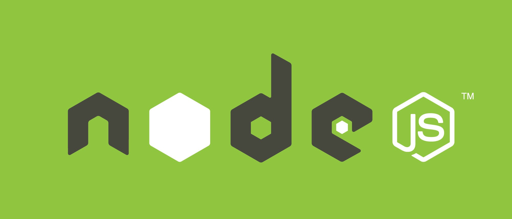

  

<h3 align="center">
  Node4Noobs
   
  
</h3>

   
  <a href="#conteúdos"><strong>Explore a documentação »</strong></a>
   
  <a href="https://github.com/anabastos/node4noobs/issues">Issues</a>
   

## Introdução
O tutorial do Node4noobs tem o objetivo de ensinar sobre o funcionamento do ecossistema Node.js e trabalhar na criação de um projeto passo-a-passo do zero até a estrutura de uma API madura com autenticação e testes automatizados fazendo uso das ferramentas mais atuais.
O intuito é que pessoas com pouca experiência possam ter conceito o suficiente para se sentirem confiantes fazendo aplicações back-end production-ready.

### Pré requisitos
Entendimento básico de linha de comando e javascript. Você pode ver outros 4noobs com esses conteúdos como o [javascript4noobs](https://github.com/ThiagoDellaNoce/javascript4noobs) ou o sh4noobs.

### O que é Node.js?
Node.js não é uma linguagem ou um framework mas sim é um ecossistema cross-platform para rodar Javascript gratuito e open source.
Ele possíbilitou que o Javascript pudesse ser usado não apenas para rodar em navegadores como também para fazer Javascript server-side, mas atualmente é uma ferramenta assêncial full-stack, ou seja, é usado para desenvolver aplicações front-end e back-end. 

## Conteúdos
1. Primeiros passos
    - [Sobre o node](./contents/1-primeiros-passos/sobre.md)
    - [Instalação](./contents/1-primeiros-passos/instalacao.md)
        * [Testando o console]()
    - [NPM](./contents/1-primeiros-passos/npm.md)
    - Configurações iniciais
        * [Eslint]()
        * [Babel]()
2. Arquitetura Básica
    - [Express]()
    - [HTTP]()
    - [Rotas]()
        * [Criando uma rota GET]()
        * [Criando uma rota com parametros]()
        * [Criando uma rota POST]()
        * [Fazendo requisições]()
    - [Config]()
    - [Middlewares]()
    - [Controllers]()
    - [Services]()
3. Database
    - [Mongoose]
    - [Models]
3. Testing
    - [Jest]
4. Auth
    - [JWT]
    - [Password middleware]()
    - [Login]
    - [Guards]
4. Assincronismo
    - [Event loop]()
    - [Operações bloqueantes]()
    - [Callbacks]()
    - [Promises]()
    - [Lidando com promises]()
    - [Event-driven]()
5. More
    - [File system]()

## Quero contribuir

Para contribuir com esse projeto maravilhoso, você:

1. Precisará criar um fork deste repositório
2. Criar um branch com o padrão: `feature/commit-maneiro`
3. Criar seu conteúdo maravilhoso nesta branch
4. Criar um pull-request neste repositório lindo
5. Esperar a avaliação do mesmo

E tchadam! Tá pronto o sorvetinho ✨

## Autores

- **Ana Luiza Portello Bastos (anabastos)** - _Software Engineer & Member of He4rt Developers_ [Twitter](https://twitter.com/naluhh)

  Made with 💜

