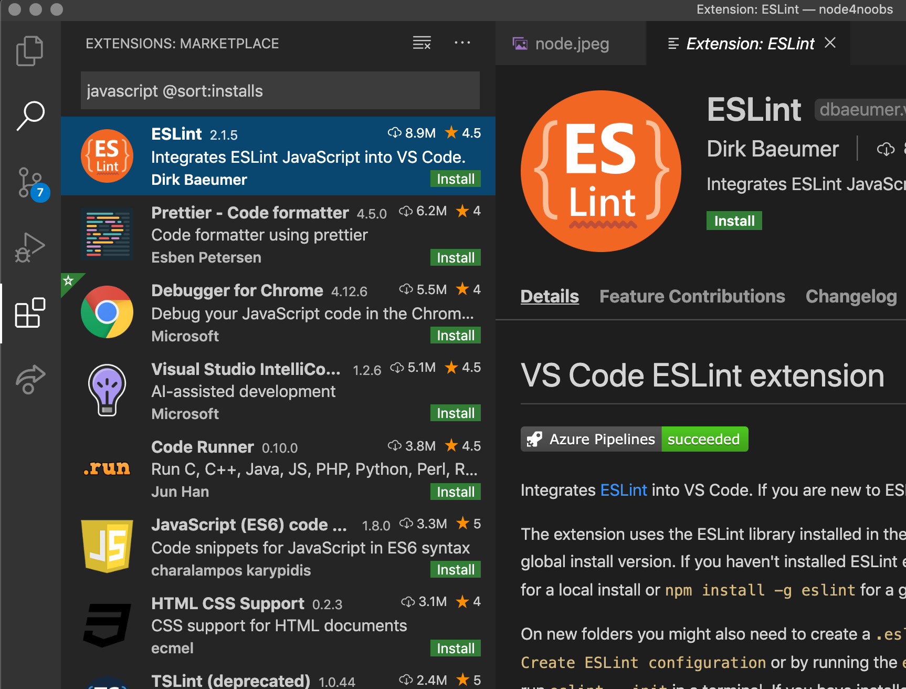

# 2. Instalação

Para o setup inicial somente é necessário ter instalado os binários do Node.Js e um editor de texto.

## 2.1 Editor de texto

Os editores mais simples e mais leves geralmente usados no desenvolvimento Javascript são o Atom ou VisualStudio. Esse tutorial utilizaremos o VSCode, mas qualquer outro editor pode ter as mesmas funcionalidades.

<p align="center">
  <a></a>
</p>

Para isso na parte de `extensions marketplace` vamos instalar as seguintes extensões:
- Eslint
- Document This
- Babel JavaScript
- Path Intellisense

O `Path Intellisense` nos ajuda com autocomplete de módulos. Faremos uso e explicaremos mais sobre as outras extensões no decorrer do curso.

### 2.2 Baixar o NVM
Baixe a ultima versão do Node.js pelo próprio site, mas vamos usar uma ferramenta mais avançada para lidar com o versionamento do Node chamado NVM (_Node Version Manager_) independente de sistema operacional. Ele permite que você instale a atualize sua versão por meio de simples comandos no terminal.

Para baixar basta rodar o seguinte comando via _cURL_ ou _wget_:

`curl -o- https://raw.githubusercontent.com/nvm-sh/nvm/v0.35.3/install.sh | bash`

`wget -qO- https://raw.githubusercontent.com/nvm-sh/nvm/v0.35.3/install.sh | bash`

E depois rodar este comando para exportar o conteúdo que foi instalado globalmente.

`export NVM_DIR="$([ -z "${XDG_CONFIG_HOME-}" ] && printf %s "${HOME}/.nvm" || printf %s "${XDG_CONFIG_HOME}/nvm")" [ -s "$NVM_DIR/nvm.sh" ] && \. "$NVM_DIR/nvm.sh" # This loads nvm`

### 2.2.1 Instalar a ultima versão do Node.js

Para baixar, compilar e instalar a ultima versão do node, rode este comando:

`nvm install node # "node" é um alias para a ultima versão`

Para usar a ultima versão instalada rode:

`nvm use node`

O NVM é uma ferramenta muito utilizada pois você pode instalar ou usar versões diferentes de node rodando comandos com o `nvm install <alguma-versão-especifica>` e `nvm use node <alguma-versão-especifica>`.

## 2.3 Testando a instalação

Podemos testar a instalação rodando no nosso terminal `node` em que temos uma interface para rodar comandos javascript.

Nessa interface podemos por exemplo, criar variáveis e checar o valor delas.
```bash
> var x = 10
undefined
> x
10
```

## 2.4 Básicos Node.js

Node.js suporta Javascript, então a sua sintaxe é similar ao Javascript que roda no navegador. Portanto se formos checar...

```bash
> typeof 10
String
> typeof 10
Number
> typeof true
Boolean
> typeof undefined
undefined
```

Temos os mesmos tipos primitivos do Javascript!
Mas diferente do Javascript que roda no navegador o Node.js tem um tipo novo chamado `Buffer` que guarda dados binários, vamos usa-lo mais a frente no curso!

Para fazer comandos de múltiplas linhas no console basta apertar **enter**, o console irá mostrar três pontos **(...)**, significando que você pode continuar na proxima linha.

```bash
> const obj = {
... x: 10
... }
undefined
```

Apertamos `crtl + c` para terminar um comando e `crtl + d` para fechar o console.
