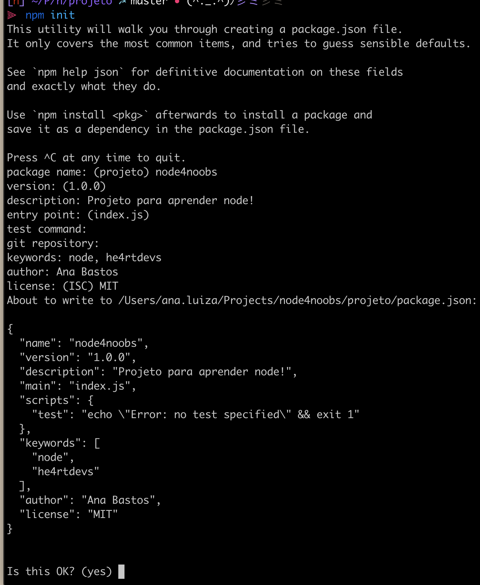
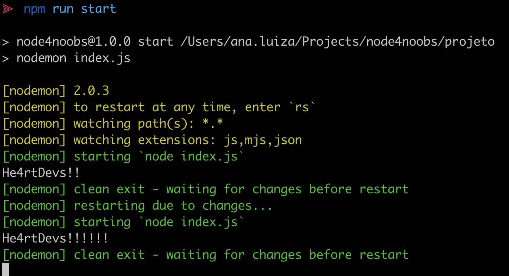

# 3. Começando o projeto pela NPM

O **NPM** (_Node Package Manager_) é uma linha de comando usada para que desenvolvedores possam compartilhar e controlar seus pacotes de código JavaScript para ser usado em projetos Node.js contendo mais de 836,000 bibliotecas abertas.

## 3.1 Primeiros Passos

Geralmente começamos um projeto por meio da `npm`, que vem junto do Node.js já instalado.
Podemos checar se temos o npm por meio do `npm version`.

Para iniciar um projeto criamos uma pasta com o nome do projeto, entramos nela e rodamos o `npm init` para gerar nosso projeto inicial.

```bash
mkdir node4noobs # Cria a pasta
cd node4noobs # Entra na pasta

npm init
```

Esse comando vai pedir que você preencha os dados obrigatórios do projeto.

O **nome** é um simples texto com o nome curto do projeto.
Por agora vamos preencher o campo **versão** apenas com o 1.0.0 conforme o sugerido.

A **descrição** também é uma string que mostra pro usuário uma breve descrição do projeto

O **entry point** vamos manter o `index.js`
E podemos pular o apertando enter também no **test command** e o **git repository**.

**keywords** são as palavras-chaves sobre o que seu projeto faz, podemos colocar coisas como "node" ou "he4rtdevs" separadas por virgula.

O campo **author** especifica o criador do projeto. Ele consiste em uma string ou um objeto com contatos ou outras informações. Geralmente uma string com seu nome já supre!

A **licença** é um campo extremamente importante para informar os usuários sobre como você pretende regulamentar seu projeto. Não é um campo obrigatório mas é sempre uma boa ideia falar explicitamente o que usuários podem ou não fazer.
É muito importante se informar sobre as licenças existentes mas por agora recomendo usar a *MIT* que é uma licença permissiva utilizada tanto em software livre quanto em software proprietário.

Campos como **keywords** ou **descrição** são principalmente importantes caso você planeja publicar seu projeto na npm para que outras pessoas que podem usar ou manter achem seu projeto facilidade.

Após preencher os campos basta digitar **YES** confirmando o conteúdo que sera seu `package.json`!

<p align="center">
  <a></a>
</p>

Quando começamos um projeto, a npm gera um arquivo `package.json`. Este arquivo é o centro do projeto Node.js. Ele consiste em um arquivo _JSON_, ou seja, um _Objeto JavaScript_, onde a informação é salva em pares de chave-valor.

Lembrando que as chaves devem estar em volta de aspas duplas (") e todos os campos devem estar separados com uma vírgula (,).
Ele guarda todas as informações de projetos com nome, versão, e diversas informações.

Ainda não criamos nosso arquivo inicial do projeto chamado `index.js`.
Portanto vamos criar esse arquivo na raiz do nosso projeto com o `console.log` que é uma forma de logarmos conteúdo no nosso console.

```javascript
// index.js

console.log("He4rtDevs!!");
```

Agora se rodarmos no nosso terminal o comando `node index.js` veremos o log `He4rtDevs!!`.

## 3.2 Instalando dependências

Lembrando que o `npm` acima de tudo é um gerenciador de dependências do projeto.
E o `package.json` tem o papel de listar os pacotes e dependências do projeto.

Podemos adicionar uma dependência pelo comando:

```bash
npm install express
```

ou a forma abreviada

```bash
npm i express
```

Express no caso é o framework mais comum para o desenvolvimento de API's node que nos provê todo o ferramental para desenvolver nossa aplicação.

Quando estamos desenvolvendo um servidor node, muitas vezes precisamos rodar, modificar um arquivo, parar o servidor e rodar novamente para ver as mudanças.

Para isso vamos instalar o `nodemon`, que é uma ferramenta para podermos rodarmos o projeto com auto-reload, ou seja, o servidor node restarta assim que mexemos com o arquivo tornando nosso desenvolvimento mais produtivo.
Pelo `nodemon` ser uma ferramenta de desenvolvimento geralmente instalamos com o `--save-dev`.

```bash
npm install --save-dev nodemon
```

Se checarmos nosso `package.json` vemos que agora as dependências do pacote está listadas

```json
"dependencies": {
  "express": "^4.17.1"
},
"devDependencies": {
  "nodemon": "^2.0.3"
}
```

As dependencias de em `devDependencies` são de pacotes que não precisamos em produção.
Um exemplo seria ferramentas de teste ou que nos ajude a rodar a plicação.
Portanto se rodarmos `npm install --production` em alguma maquina, ele vai ignorar completamente as `devDependencies`.

Como podemos remover esses pacotes se não queremos mais eles? Apenas removemos a chave-valor do `package.json`!
Só tome cuidado para tirar todas as referências dentro do código dessas dependências.

Agora no nosso projeto também temos um arquivo chamado `package-lock.json` que serve para garantir uma instalação consistênte das dependências, nunca mexemos nele pois ele é gerado, e uma pasta `node_modules`.
Todos os pacotes são salvos na pasta `node_modules`. Por ser uma pasta com arquivos muito grandes geralmente o colocamos dentro de um arquivo `.gitignore` em nosso projeto para que não publiquemos acidentalmente por exemplo, no github.

```
// .gitignore

node_modules/
```

Se quisermos atualizar ou instalar de novo a parta `node_modules` basta rodar o comando `npm i`

### 3.2.1 Versionamento de pacotes

As versões dos pacotes npm seguem o que chamamos de ["Semantic Versioning (SemVer)"](https://semver.org/), que é um padrão de versionamento de software para podermos tornar mais fácil o gerenciamento de dependências. Dessa forma podemos ser específicos sobre qual versão queremos usar ou se queremos garantindo com que updates não quebrem seu projeto.

```json
"package": "MAJOR.MINOR.PATCH"
```

A versão *MINOR* apenas incrementa novas funcionalidades enquanto o *PATH* fazer fixes e resolve bugs. Incrementar essas versões não devem "mudar" alguma funcionalidade já existênte.
Uma versão *MAJOR* incrementa mudanças completamente incompatíveis com as anteriores. Se você adicionar uma dependência e usar uma função chamada "x", uma mudança nessa versão pode fazer com que a função já tenha outro nome.

Então por exemplo, se sair uma versão 5.0 do express é bem possível que algumas das coisas que já uso dele parem de funcionar!

Na maioria das vezes não queremos perder bug fixes de nossas ferramentas mas não queremos correr o risco que o que funciona hoje, pare de funcionar amanhã. Pra isso podemos congelar um pacote em uma versão que queremos em nossas dependências usamos o tio (~). Ele permite apenas releases de PATCH nos pacotes. Permitindo updates em qualquer versão 4.14.x

```json
"dependencies": {
  "express": "~4.14.0"
}
```

Para permitir releases PATCH e MINOR usamos o chapéu (^). Permitindo updates em qualquer versão 4.x.x

```json
"dependencies": {
  "express": "^4.14.0"
}
```

## 3.2.3 Rodando o arquivo raiz com nodemon por meio de scripts

Note que temos o campo `scripts` no nosso arquivo, esse scripts é um meio de automatizar tarefas repetitivas.

Geralmente criamos scripts para iniciar o servidor, rodar testes, ou rodar geradores de código.
O conteúdo de um `script` consiste em um simples comando de terminal portanto podemos automatizar o comando `node index.js` que acabamos de rodar.

Após um tempo rodar o arquivo raiz do nosso projeto vai se tornar cada vez mais longo complexo dependendo da nossa configuração, para isso vamos criar o comando `start` que roda o arquivo raiz do nosso projeto chamando a dependência que acabamos de instalar , o `nodemon`.

```json
...
  "scripts": {
    "start": "nodemon index.js"
  },
...
```

Agora se rodarmos `npm run start` veremos o log `He4rtDevs!!`.

Se alterarmos o conteúdo do nosso `index.js` para `console.log('He4rtDevs!!!!!!!!')` automaticamente nosso veremos o novo log `He4rtDevs!!!!!!!!` no terminal.

<p align="center">
  <a></a>
</p>
